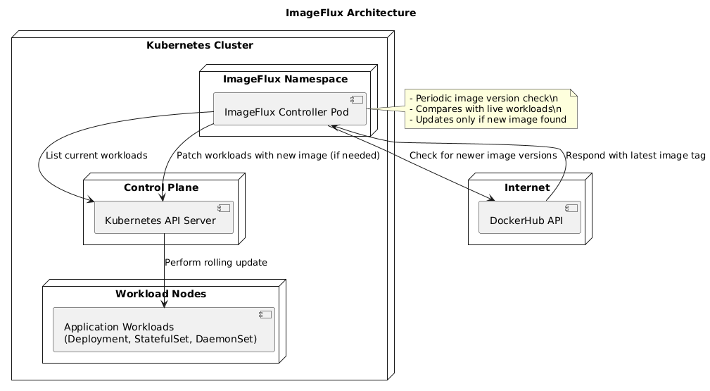

# imageFlux

**imageFlux** is a lightweight Kubernetes controller that automatically checks for the latest container image tags on Docker Hub and updates Kubernetes Deployments if newer versions are available.

> Designed for simplicity, built with Golang, and made for Platform Engineers who love automation.

---

## Features

- Scans Deployments with a specific annotation (opt-in model)
- Checks Docker Hub for the latest image tags
- Updates Deployments if they are using an outdated tag
- Built as a standalone controller (no CRDs required)
- Periodic sync with customizable interval

---

## Design Patterns Used
- Controller Loop

- Pull Pattern

- Adapter Pattern for DockerHub + Kube Clients

- Separation of concerns using clean internal package structure

## Architecture




## How It Works

1. Scans the cluster for Deployments annotated with:

   ```yaml
    ImageFlux: "Enabled"
   ````
2. Extracts the image name and tag from the Deployment.

3. Queries Docker Hub for the latest available tag.

4. If the current tag is outdated, patches the Deployment with the new image tag.

# Getting Started
## Prerequisites
- Go 1.20+
- Kubernetes cluster access (via ~/.kube/config)
- Deployments annotated with ImageFlux: "Enabled"

## Build & Run Locally
```
git clone https://github.com/rajeshdeshpande02/imageFlux.git
cd imageFlux
go build -o imageflux ./cmd/main.go
./imageflux

```

# Roadmap

 Support for DaemonSets & StatefulSets

 Support for private registries

 Custom image update policies

 Webhook notifications on update


# Author
Rajesh Deshpande

DevOps | Kubernetes | Golang | Platform Engineering

📌 Linkedin : https://www.linkedin.com/in/rajesh-deshpande-1058b9151/

📦 GitHub: @rajeshdeshpande02


